



 


<h2 align="center">⚡ PLAYER PROFILE</h2>

  
  

<h2 align="center">📊 CHARACTER STATS</h2>

  
  

<h2 align="center">🎯 CURRENT QUEST</h2>

  

<h2 align="center">🚀 FEATURED BUILDS</h2>

  
  
  
  

<h2 align="center">🏆 ACHIEVEMENTS UNLOCKED</h2>

  
  
  
  
  
  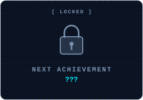

<h2 align="center">🧪 EXPERIENCE</h2>

  

<h2 align="center">🌳 TECH STACK TREE</h2>

  

<h2 align="center">🧩 SIDE QUESTS</h2>

  

<h2 align="center">🐍 CONTRIBUTION QUEST</h2>

  <picture>
    <source media="(prefers-color-scheme: dark)" srcset="https://raw.githubusercontent.com/dipsitarout/dipsitarout/output/github-snake-dark.svg">
    <source media="(prefers-color-scheme: light)" srcset="https://raw.githubusercontent.com/dipsitarout/dipsitarout/output/github-snake.svg">
    
  </picture>

<h2 align="center">📜 PLAYER LOG</h2>

  

<h2 align="center">💻 SYSTEM STATUS</h2>

  

<h2 align="center">📡 CONNECT</h2>

  
  
  
  

XP, levels, difficulty ratings and stat bars are game-style visuals, not official ratings.

